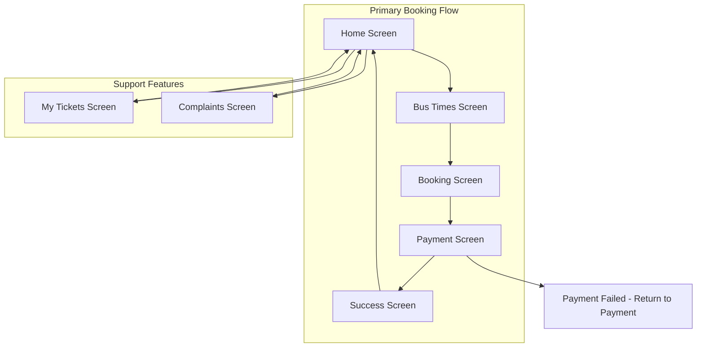

# Navigation System Design Document

## Overview

This design document outlines the implementation of a stack-based navigation system for the Travelin bus booking mobile application. The system will replace the current tab-based navigation with a more appropriate flow-based navigation that guides users through the bus booking process while providing easy access to support features.

The navigation system will be built using React Navigation's native stack navigator, providing smooth transitions and proper navigation history management. The design prioritizes user experience by creating logical flow paths while maintaining accessibility to all app features.

## Architecture

### Navigation Structure

The application will use a single native stack navigator as the primary navigation container, replacing the current Expo Router tab-based system. This approach provides:

- Linear user flows for complex processes (booking, payment)
- Proper navigation history and back button support
- Consistent screen transitions
- Better state management across screens

### Navigation Flow Diagram



## Components and Interfaces

### Core Navigation Components

#### 1. Navigation Container Setup
- **Component**: `NavigationContainer` from `@react-navigation/native`
- **Purpose**: Root navigation wrapper providing navigation context
- **Configuration**: Theme integration with existing color scheme system

#### 2. Stack Navigator
- **Component**: `createNativeStackNavigator` from `@react-navigation/native-stack`
- **Configuration**: 
  - `headerShown: false` for consistent UI design
  - Screen options for each route
  - Navigation parameters for data passing

#### 3. Screen Components Integration
- **Existing Screens**: Leverage current screen files in `app/(tabs)/`
- **Screen Mapping**:
  - `index.tsx` → Home Screen
  - `bus_times.tsx` → BusTimes Screen  
  - `bookings.tsx` → Booking Screen
  - `payments.tsx` → Payment Screen
  - `TicketSuccess.tsx` → Success Screen
  - `complaints.tsx` → Complaints Screen
  - `myTickets.tsx` → MyTickets Screen

### Navigation Parameters Interface

```typescript
type RootStackParamList = {
  Home: undefined;
  BusTimes: {
    searchCriteria?: {
      from: string;
      to: string;
      date: string;
    };
  };
  Booking: {
    selectedRoute: {
      routeId: string;
      departure: string;
      arrival: string;
      price: number;
    };
  };
  Payment: {
    bookingDetails: {
      routeId: string;
      passengerCount: number;
      totalAmount: number;
    };
  };
  Success: {
    ticketId: string;
    bookingReference: string;
  };
  Complaints: undefined;
  MyTickets: undefined;
};
```

## Data Models

### Navigation State Management

#### 1. Route Parameters
- **BusTimes Screen**: Search criteria (origin, destination, date)
- **Booking Screen**: Selected route information
- **Payment Screen**: Booking details and pricing
- **Success Screen**: Confirmation details

#### 2. Navigation Context
- **User Session**: Maintained across all screens
- **Booking Flow State**: Preserved during booking process
- **Error Handling**: Navigation state for error recovery

### Screen State Persistence

```typescript
interface NavigationState {
  currentScreen: keyof RootStackParamList;
  bookingFlow: {
    isActive: boolean;
    currentStep: 'search' | 'booking' | 'payment' | 'success';
    data: any;
  };
  userSession: {
    isAuthenticated: boolean;
    userId?: string;
  };
}
```

## Implementation Strategy

### Phase 1: Navigation Infrastructure
1. Install and configure React Navigation dependencies
2. Create navigation container and stack navigator
3. Define screen components and parameter types
4. Implement basic navigation between screens

### Phase 2: Screen Integration
1. Migrate existing screen components to stack navigation
2. Implement parameter passing between screens
3. Add navigation actions to screen components
4. Test navigation flows

### Phase 3: User Flow Optimization
1. Implement booking flow state management
2. Add navigation guards for incomplete flows
3. Implement error handling and recovery navigation
4. Add navigation analytics and tracking

## Error Handling

### Navigation Error Scenarios

#### 1. Invalid Navigation Parameters
- **Detection**: Parameter validation on screen entry
- **Recovery**: Redirect to appropriate fallback screen
- **User Feedback**: Clear error messages

#### 2. Broken Navigation Flow
- **Detection**: Navigation state validation
- **Recovery**: Reset to Home screen with preserved user data
- **Logging**: Track navigation errors for debugging

#### 3. Screen Loading Failures
- **Detection**: Component error boundaries
- **Recovery**: Fallback UI with retry options
- **Navigation**: Maintain navigation stack integrity

### Error Recovery Navigation

```typescript
const handleNavigationError = (error: NavigationError) => {
  switch (error.type) {
    case 'INVALID_PARAMS':
      navigation.navigate('Home');
      break;
    case 'SCREEN_LOAD_FAILED':
      // Show error screen with retry option
      break;
    case 'FLOW_INTERRUPTED':
      // Preserve partial data and restart flow
      break;
  }
};
```

## Testing Strategy

### Navigation Testing Approach

#### 1. Unit Tests
- **Screen Navigation**: Test individual screen navigation actions
- **Parameter Passing**: Validate correct parameter transmission
- **Navigation Guards**: Test flow validation logic

#### 2. Integration Tests
- **Complete Flows**: Test end-to-end booking process
- **Error Scenarios**: Test error handling and recovery
- **State Persistence**: Validate data preservation across navigation

#### 3. User Experience Tests
- **Navigation Performance**: Measure screen transition times
- **Flow Completion**: Track successful booking completion rates
- **Error Recovery**: Test user recovery from navigation errors

### Test Implementation Framework

```typescript
// Example navigation test structure
describe('Navigation System', () => {
  describe('Booking Flow', () => {
    it('should navigate from Home to BusTimes with search criteria');
    it('should pass route data from BusTimes to Booking');
    it('should handle payment success navigation');
    it('should recover from payment failure');
  });
  
  describe('Support Features', () => {
    it('should access MyTickets from any screen');
    it('should access Complaints from any screen');
  });
});
```

## Performance Considerations

### Navigation Optimization

#### 1. Screen Loading
- **Lazy Loading**: Load screens on demand
- **Preloading**: Preload likely next screens
- **Caching**: Cache frequently accessed screens

#### 2. State Management
- **Minimal State**: Keep navigation state lightweight
- **Efficient Updates**: Optimize state update frequency
- **Memory Management**: Clean up unused navigation data

#### 3. Transition Performance
- **Native Transitions**: Use native stack navigator for smooth animations
- **Gesture Handling**: Optimize swipe and back gesture performance
- **Animation Timing**: Configure appropriate transition durations

## Security Considerations

### Navigation Security

#### 1. Parameter Validation
- **Input Sanitization**: Validate all navigation parameters
- **Type Safety**: Use TypeScript for parameter type checking
- **Boundary Checking**: Validate parameter ranges and formats

#### 2. Flow Integrity
- **Authentication Checks**: Verify user authentication for protected screens
- **Authorization**: Check user permissions for specific features
- **Session Management**: Handle session expiration during navigation

#### 3. Data Protection
- **Sensitive Data**: Avoid passing sensitive data through navigation parameters
- **State Encryption**: Encrypt sensitive navigation state data
- **Audit Trail**: Log navigation events for security monitoring